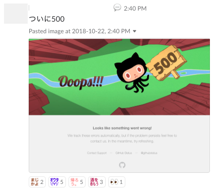

# slack_emoji_generator
Generate slack emoji by command


## Why this tool?
Sometime one emoji is better than lines of chatting.



## Usage

```
$ruby slack_emoji.rb [-bfosth] "text"

Options:
  -b: Emoji background color. Default: transparent
  -f: Emoji font size. Default: 15
  -o: Emoji output file. Default: input_text.png
  -s: Emoji size (horizontal x vertical) in px. Default: 60x60
  -t: Emoji text color. Default: pink
  -h: Print help message

Example:
$ruby slack_emoji.rb -b white -f 20 -s 100x100 -t black "this is text in emoji" -o slack_emoji_output.png
```

See `ruby slack_emoji.rb -h` for more details
